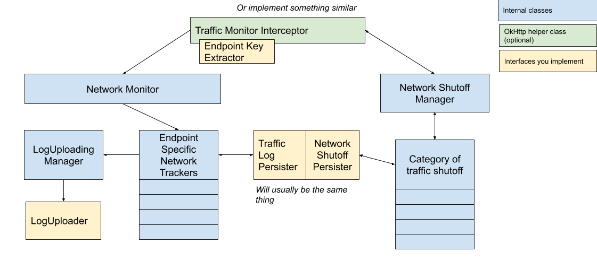
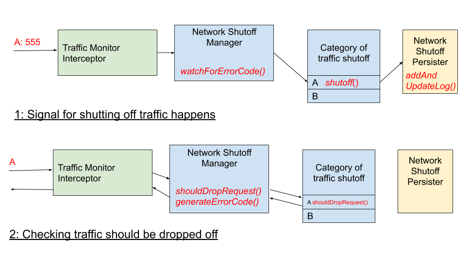
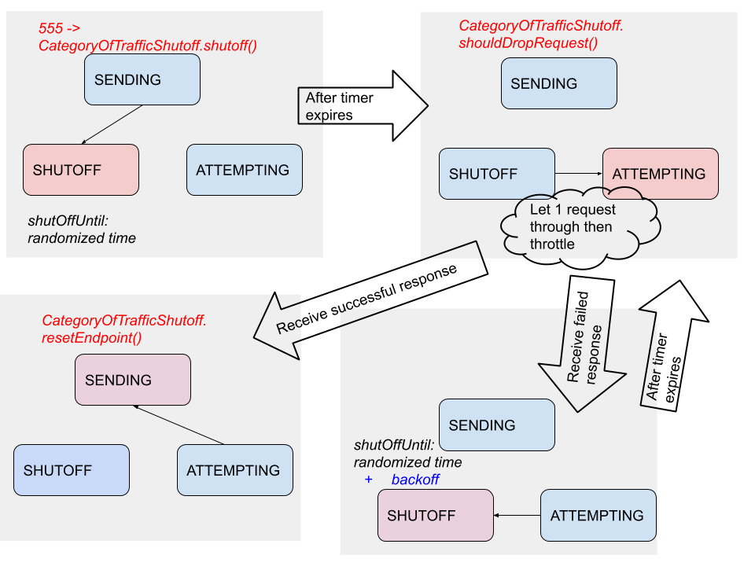
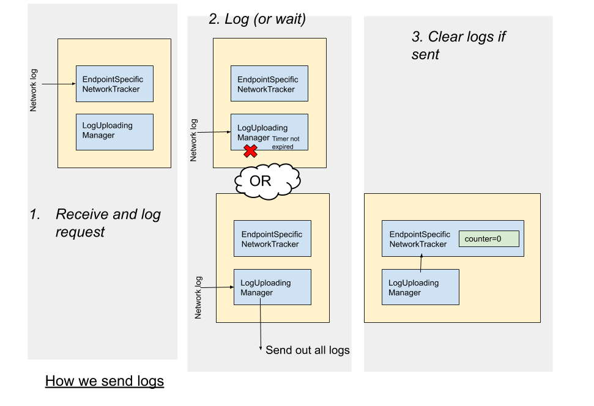

## Varanus the monitor lizard will monitor your network traffic and protect you and your users from excessive network requests.


[](https://travis-ci.org/Yelp/android-varanus)
[](https://twitter.com/YelpEngineering)
[](LICENSE)

Varanus is the scientific name for monitor lizards.  Varanus the library tracks the impact that network traffic has on  users' data, both overall and by endpoint, so you can detect when your new features are consuming too much data and address it quickly.  In an emergency, Varanaus can also easily shut off traffic from the app, including traffic to specific endpoints.  The original goal of Varanus was to protect against bugs where an excessive amount of network traffic is sent, potentially accidentally DDOSing the site (as described in [this droidcon talk](https://www.youtube.com/watch?v=8xLDdYM_nRY).  However it's suitable for managing and monitoring network traffic more generally. 

We've tried to make it as general as possible so that it can be incorporated into other network setups, but we've provided the most support to using okhttp.

We have a simple sample app included that shows how to set this up.  However, for logging you probably want to actually send the logs somewhere, we just display the logs in the activity for illustrative purposes.  Also, you would want the network monitor to be set up in an Application class.

## How it works

The way we have it set up, everything gets added to an OkHttp interceptor (green), but using it with okhttp isn't mandatory.  This then calls out to several other classes.  

The Network Monitor tracks network requests, via a list of EndpointSpecificNetworkTrackers that store the state for each endpoint.  To reduce the overhead of this tracking, we summarize and flush these logs via the LogUploadingManager.  You implement a LogUploader to actually send network logs wherever you want them.  These don't send logs on a regular schedule, rather logs have a minimum interval between being updated.  They also only piggyback on other requests.  This means you won't get logs when the device isn't sending traffic - but it doesn't really need to.  It also means the battery overhead of this library will be very low.

It also calls out to the NetworkShutoffManager.  It asks this class whether or not it should be dropping requests, as well as passes it requests so it can determine when to start dropping requests.  Similarly, this keeps state about each endpoint individually.

Both of these are saved to a persistent database, so that after a restart you continue doing the same thing.  This is because a plausible scenario for sending too much traffic might involve the app crashing and restarting a lot.



### Network Shutoff

We used a 555 error code to shut off all traffic from an endpoint and a 556 error code to shut off all traffic generally.  These are easy to remember and not real error codes (so this won't be triggered by mistake), but can be configured.  An interceptor observes all traffic and watches for this error code as a signal as to when to start dropping traffic.  The interceptor can also drop traffic, since all traffic is routed through it.



An endpoint can actually be in three states.  When SENDING, the interceptor does nothing except watch for the appropriate error code.  When it gets that code, it switches to SHUTOFF and sets a timer.  After the timer expires, it changes to ATTEMPTING and lets the first request through, then throttles requests.  If another error code comes back, it goes back to SHUTOFF and waits again, but with an increasing backoff.  Otherwise, it goes back to SENDING.  This state is also saved in a persistent database in case of restarts.



### Network Logging

This is pretty straightforward - we add up network requests and sizes, and send it out in batches piggybacking on existing requests, but don't send anything until a timer expires.  After sending, we clear all the logs.



## Setup

```groovy
// Top level build.gradle
allprojects {
	repositories {
		mavenCentral()
	}
}

// Module level build.gradle
dependencies {
    implementation "com.yelp.android:varanus:<version-number>"
}
```

## Contributing

We highly encourage contributions from the community, even if you've never contributed to an open source project before! If you see an issue but don't have time to fix it, open an issue in this repository.

### Steps for Contributing

#### 0. Requirements

There are a few requirements to compile Varanus.

- Python is needed for the [pre-commit](https://pre-commit.com/) hooks to run
- Java and Kotlin are needed to actually compile the project
- Android Studio (we recommend >= 3.3.2)

#### 1. Get the code

Fork the this repository, and then clone the code to your local machine.

#### 2. Prepare the git hooks

Once you have the repo on your machine, run the following command from the root of the project.

```
$ make install-hooks
```

These git hooks will make sure you're not committing private keys to the repository. In the future we might add more functionality.

#### 3. Create a new branch

We usually like branches to be named:

- `username/issue-number/what-it-do`
- `targo/24/fix-item-range`

#### 4. Build, change, test, commit

Repeat as necessary. The project should build from within Android Studio and if it doesn't, see the help section below. You should also be able to compile and run the `varanus-sample-app` to test your changes.

You can also run `./gradlew publishToMavenLocal` to publish the package to your local maven repo on your machine. From there you can add `mavenLocal()` before other maven repositories. That way your project can load in the version of Varanus you're working on.

We follow [semver](https://semver.org/) so the version number in `GlobalDependencies.kt` should be updated to reflect the changes.

Add a summary of your change to the `CHANGELOG.md` file.

#### 5. Push your changes and open a pull request

Push your branch with the new commits to your cloned repo, then open a pull request through GitHub. Once Travis CI gives it a green light along with a member of our team, it will be merged and the new version will be deployed to Maven Central.

## Help

- Open a GitHub issue and tag it with the `Question` tag
- Ask a question on StackOverflow and tag it with `varanus` and `android`

## License

Apache 2.0 - Please read the [LICENSE](LICENSE) file.
